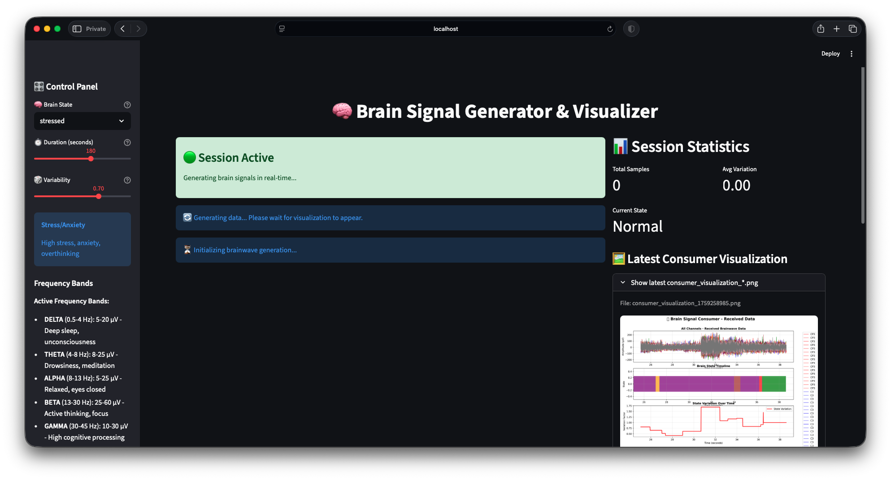
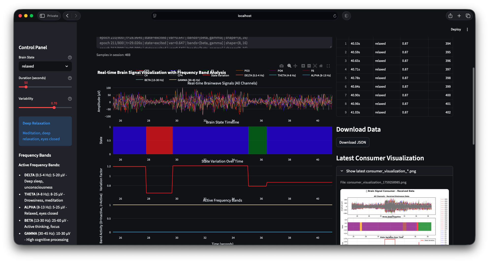

# Neuro Brainwaves Generator

Synthetic brainwave signals for research, demos, and ML pipelines **without EEG hardware**. This project uses **AI and machine learning–style simulation** (state-driven generators, forecasting helpers in the neuro subproject, and rich visualization) to produce plausible multi-channel waveforms, timelines, and exports you can treat like software-generated neuro data.

## Objective

- **Generate brain-like signals in software** — Delta through Gamma bands, tunable variability, and labeled cognitive/brain states (for example relaxed, stressed, focused), with no headset or electrodes.
- **Support end-to-end workflows** — From scripted generators and Streamlit dashboards to optional producer/consumer patterns and a **`neuro_brainwave_ai_project/`** stack for deeper experimentation.
- **Stay repeatable** — JSON/PNG and dataset-style outputs land under configurable paths (see `paths.py`); large generated `.jsonl` datasets are intended to be produced locally, not checked into Git.

## Preview

**Brain Signal Generator & Visualizer** — session controls, live status, and latest consumer visualization:



**Real-time visualization with frequency-band context** — multi-channel traces, state timeline, variation, and export hooks:



## Repository layout

| Area | Role |
|------|------|
| [`assets/`](assets/) | README screenshots (small PNGs; safe to commit). |
| `data/` | Default output for JSON/PNG and runtime artifacts (created locally; listed in `.gitignore`, not on GitHub). |
| [`scripts/`](scripts/) | Setup, Streamlit, producer/consumer, and neuro subproject launchers. |
| [`brain_signal_streamlit_app.py`](brain_signal_streamlit_app.py) | Main Streamlit entry for generation and visualization. |
| [`neuro_brainwave_ai_project/`](neuro_brainwave_ai_project/) | Extended neuro-AI demos, generators, and optional LSTM-oriented pieces. |

## Quick start (local)

```bash
python -m venv .venv
source .venv/bin/activate   # Windows: .venv\Scripts\activate
pip install -r requirements.txt
pip install -r requirements_streamlit.txt
streamlit run brain_signal_streamlit_app.py
```

Use `scripts/setup_env.sh` and the launch scripts under `scripts/` for a scripted workflow.

## Documentation

If you maintain a local `docs/` tree (not tracked in this repository), you can add Quick Start and architecture notes there; the canonical runnable entry points are the Python modules and shell scripts above.
